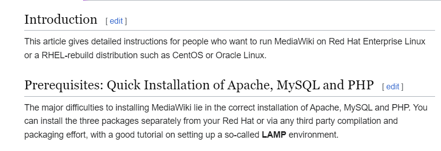
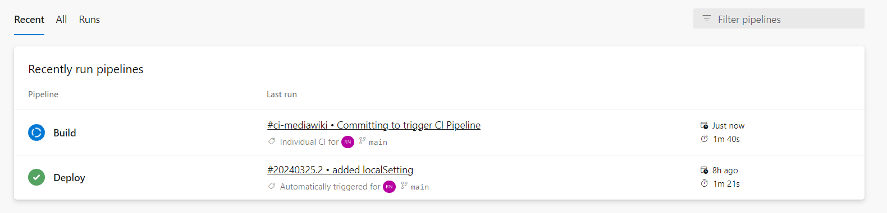

# **REQUIREMENTS:**
    MEDIAWIKI PROBLEM STATEMENT
    ( We expect this to be installed using below link. )

[Installation Guide](https://www.mediawiki.org/wiki/Manual:Running_MediaWiki_on_Red_Hat_Linux)


***


As Mentioned in the installation link, We are going to setup LAMP environment.
- L - Linux - CentOS   ( CentOS Linux is a rebuild of Red Hat Enterprise Linux ). 
- A - Apache
- M - MySQL
- P - PHP

FOR LAMP environment Setup We are going to use Docker images.
- Application Image - Contains CentOS , Apache, PHP
- MYSQL Image - MYSQL

### **SERVICES AND TOOLS USED:**
- TERRAFORM
- HELM
- KUBERNETES ( AZURE )
- AZURE
- DOCKERHUB
- Service Connection in Azure DevOps to Establish connection to Azure and DockerHub .

## STEPS:
1. Create Infrastructure Using Terraform.
1. Trigger CI Pipeline by Pushing Some Changes to mediawiki Directory.
1. Check for the Website Url ( kubectl get svc -n media-wiki-ns )
1. Setup the Mediawiki Website and download the LocalSettings.php
1. Push the LocalSettings.php to mediawiki Directory


# **Create Infrastructure Using Terraform**
Run following commands in terraform directory

```
terraform init
terraform plan -out myplan
terraform apply myplan
```


Creates three resources
- Resource group
- Azure Kubernetes Service
- NodePool

# **Trigger CI Pipeline by Pushing Some Changes to mediawiki Directory.**

# _Simple Change is made to mediawiki Directory._


# _Build Pipeline (CI) started running on trigger_


# _Deploy Pipeline (CD) started running on trigger by completion of Build Pipeline_


# _Deploy Pipeline (CD) requires Approval_


# _Post Approval CD gets triggerred and completed_


# _Post Completion, see the status of deployment using the command 
`kubectl get all -n media-wiki-ns_`


# _Get External IP Address (Load Balancer IP - 4.188.3.246)_


# _Click on setup the wiki_


# Values 
_Database-host = Name of DB service_

_Database-name = wiki_db ( added in Dockerfile.DB )_

_Database-password = root ( added in Dockerfile.DB )_


# _Create Wiki and User Account_


# _Download LocalSettings.php_


# _Add LocalSettings.php to mediawiki directory_


# _Push to the Repository_


# _Pipeline started_ 


# _Once Completed , Setup is Completed and is ready to Use._

